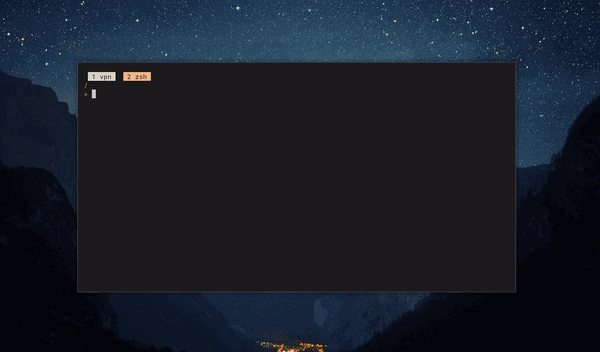
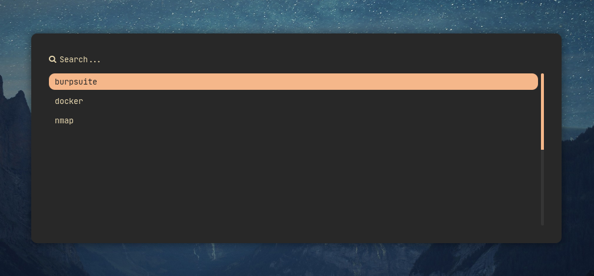
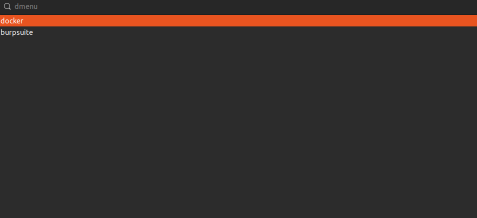
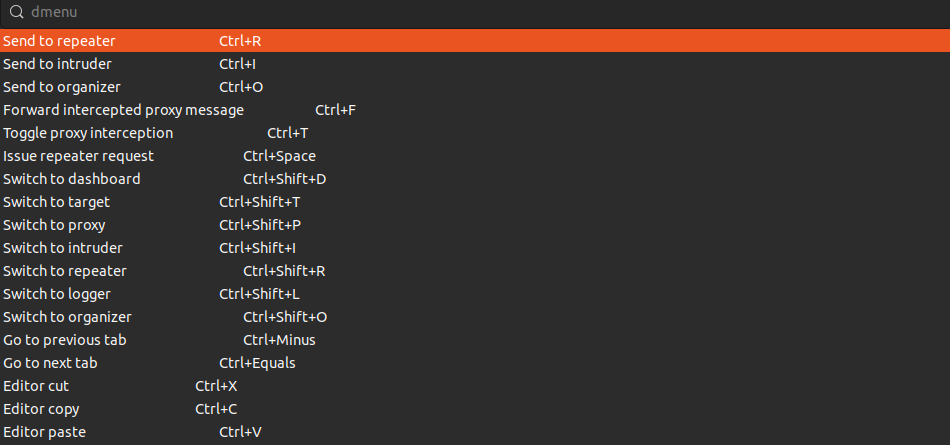

<h3 align="center" style="color: white;">Dynamic menu for your cheat sheets in simple YAML.</h3>

<p align="center">
  <a href="#use-cases">Use cases</a> •
  <a href="#how-it-works">How it works</a> •
  <a href="#install-cheatmenu">Install</a> •
  <a href="#how-to-create-a-cheat-sheet">How to create a cheatsheet</a> •
  <a href="#wayland-support">Wayland support</a>
</p>

---
cheatmenu uses ([rofi](https://github.com/davatorium/rofi) / [wofi](https://hg.sr.ht/~scoopta/wofi)) dmenu to generate a dynamic menu with a list of available cheat sheets and a cheat sheet itself. The cheat sheets are actually stored in submodule repository - [cheatmenu-sheets](https://github.com/tokiakasu/cheatmenu-sheets). 

Works only on Linux with X.Org (looks good) and Wayland (looks sketchy) display servers.

## Use cases

cheatmenu supports string search and automatically copies a selected command (without description!) from the cheat sheet directly to the clipboard.

Knowing this, possible usage scenarios are as follows
- handy reminder of a hotkeys for an application
- menu of frequently (or not so frequently) used CLI commands
- list of a facts with a description (???)

and any other scenarios that fit the "there must be a description and a value" condition.

## How it works

Each cheat sheet is a YAML file with fields: 
- application (for the name of the application)
- action (as a description of the command)
- command (the command itself)

Each YAML file is located in the application name directory inside the "sheets" directory.

Cheatmenu searches for YAML files in the "sheets" directory, generates a list and sends it to dmenu, where the user must choose which application to display the cheat sheet for. 

Next, cheatmenu parses the YAML file for the selected application and sends it to dmenu, which generates a searchable and selectable cheat sheet menu. 

After selecting a line of the cheat sheet, cheatmenu copies the command value to the clipboard.

<p align="center">
  
</p>

| :exclamation:  **Disclaimer**  |
|---------------------------------|
| This project was created primarily to use X.Org display server and execute when hotkey shortcuts are pressed, not as a standalone CLI tool. |

## Install cheatmenu

You'll need to install:
- `JetBrainMono` font
- `go-yq` (YAML parser) and `xclip` (copy anything to clipboard) packages
- `rofi` or `wofi`, depending on the display server

However, the `setup.sh` script can install everything for you.

Clone the repository, _cd_ into it, run './cheatmenu/setup.sh' and follow the instructions.

```shell
git clone https://github.com/tokiakasu/cheatmenu.git
cd cheatmenu
./cheatmenu/setup.sh
```

### Check if everything works

Everything installed and there is no `[-]` in the script logs?

That's awesome! Now try to run `$XDG_CONFIG_HOME/cheatmenu/cheatgenerator.sh` from CLI. 

The application selection menu should appear, as in the screenshot below.

<p align="center">
  
</p>

Select `nmap`. A new menu should have appeared, but with nmap cheat sheets.

<p align="center">
  
</p>

### How to use

If everything works as in the screenshots above, all you have to do is assign a hotkey combination to execute the `$XDG_CONFIG_HOME/cheatmenu/cheatgenerator.sh` script.

For example, I'm using a combination `super + alt + Home` to execute `"$XDG_CONFIG_HOME/cheatmenu/cheatgenerator.sh"`

## How to create a cheat sheet

A cheat sheet is defined in a YAML file with following structure:

```yaml
application: application-name
shortcuts:
- action: description-1
  command: command-1
- action: description-2
  command: command-2
- action: description-3
  command: command-3
# Add more shortcuts...
```

Each YAML file is located in the application name directory inside the "sheets" directory.

```directory
sheets
├── burpsuite
│   ├── burpsuite.yaml
│   └── converter
│       └── burp2yaml.py
├── docker
│   └── docker.yaml
└── nmap
    └── nmap.yaml
```

### Example 1

YAML file for Burp Suite cheatsheet

```yaml
application: burpsuite
shortcuts:
- action: Send to repeater
  command: Ctrl+R
- action: Send to intruder
  command: Ctrl+I
- action: Send to organizer
  command: Ctrl+O
- action: Forward intercepted proxy message
  command: Ctrl+F
- action: Toggle proxy interception
  command: Ctrl+T
```

### Example 2

YAML file for nmap cheatsheet

```yaml
application: nmap
shortcuts:
- action: Find NSE scripts
  command: locate .nse | grep ftp
- action: Help manual for scripts
  command: nmap --script-help ftp-anon
- action: Scan a target using all NSE scripts. May take an hour to complete.
  command: nmap -p 80 --script=all 10.0.0.1
- action: Filter all the IPs from result file
  command: grep -o '[0-9]\{1,3\}\.[0-9]\{1,3\}\.[0-9]\{1,3\}\.[1-9]\{1,3\}' alive.xml | uniq
- action: Initial scan TCP
  command: nmap -sC -sV -O -oA nmap/initial 10.10.10.3
- action: Discover hosts via ICMP requests
  command: sudo nmap -sn -PE 10.124.0.0/26 --disable-arp-ping --source-port 53
- action: Agressively scan all ports
  command: nmap -p- -sV -A -T4 scanme.nmap.org
- action: Insert data to all of the ICMP packets
  command: sudo nmap -sn -PE --data-string 'randddo' 10.124.0.0/26 --disable-arp-ping --source-port 53
```

## Wayland support

`cheatgenerator.sh` along with `setup.sh` automatically detect the display server and use the appropriate `dmenu` launcher 
- `rofi` for X.Org
- `wofi` for Wayland

The `dmenu` via `wofi` looks sloppy and opens closer to the top left corner for some reason, but it works. 

<h1 align="center">
  
</h1>

<h1 align="center">
  
</h1>
